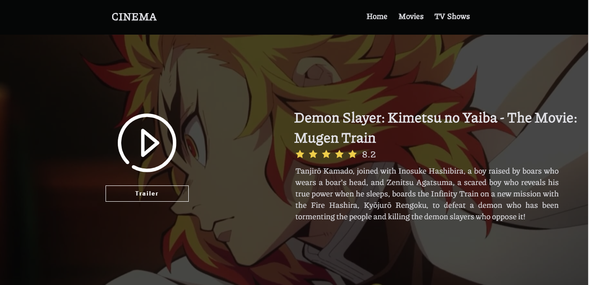

# CINEMA

## You can see the app running here

https://cinema-ten.vercel.app/

## Tools used

```
- React.JS
- Next.JS
- TypeScript
```

## Preview





## How run my app

```
1 - Clone from github.
2 - Run yarn install.
3 - Run yarn start.
4 - Enjoy.
```
